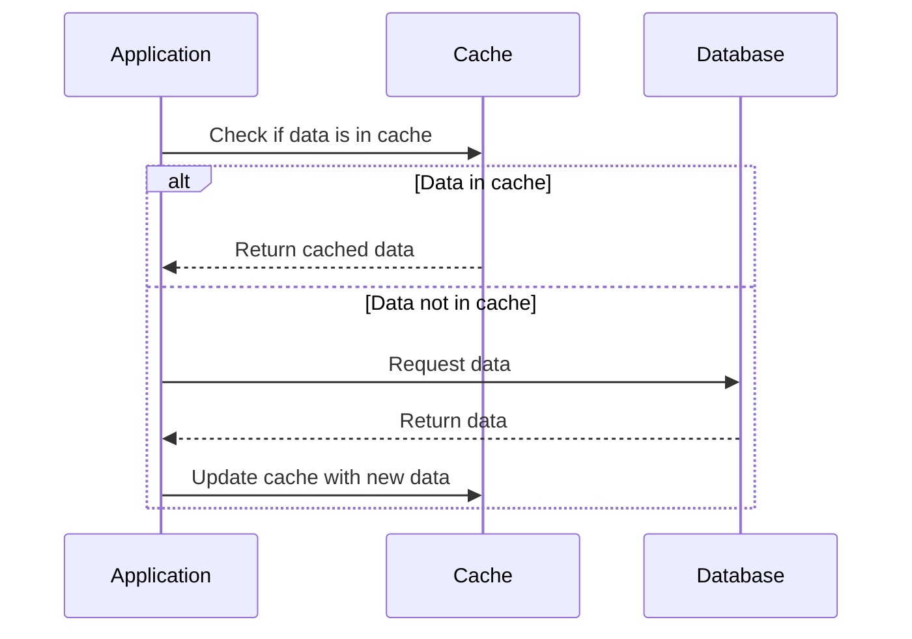

# Redis caching for Testlify

Currently, we're using a `cache-aside` pattern i.e. we first check if the data exists in the cache, if not then we fetch it from the database and store it in the cache for future use.



> **NOTE**: Caching can easily be disabled for debugging purposes by simply flipping the parameter `USE_CACHE` to `false`

## Caching for the public routes

- Done using a simple caching wrapper with the default `TTL` of 5 minutes and can be changed.

CODE/LOGIC:

```ts

// Log-messages/Error-handling removed for brevity

async  get<T>(key: string, fetcher: () =>  Promise<T>, ttl=this.ttl): Promise<T> {

const cachedValue = await  this.redisClient.get(key);

if (cachedValue) {
    return  JSON.parse(cachedValue) as  T;
}
const result = await  fetcher();
await this.redisClient.set(key, JSON.stringify(result), 'EX', ttl);
return result;
}

```

USAGE:

```ts
// previous code

const data = await this.exampleRepository.find();

// new code

const cacheKey = `example:${id}`;

const data = await this.cacheService.get(cacheKey, () =>
  this.exampleRepository.find(id)
);
```

Currently, we've implemented caching using above scheme for the following routes:

```

GET /v1/language --> language list
GET /v1/test/library/filter?language= --> Test library list on language basis
GET /v1/assessment/coding/language --> coding language list
GET /v1/public/language/userType/{userType} ->> language list for EMPLOYER/CANDIDATE
GET /v1/public/language/{code} --> translation text e.g en,fr
GET /v1/question? --> questions
GET /v1/test/library?limit= --> Test library list


Extra:
`organization` lookup in jwt-auth middleware
`userWorkspaceProfile` lookup in jwt-auth middleware
```

## Caching for the authenticated routes

We're using similar functionality with the authenticated routes, but we're leveraging a different data structure `HashSet`.

- Similar wrapper but now requires a `user_id` to be passed as a parameter.
- The `user_id` is used as a key to store the data in Redis `hset`

> **Reason**: Since HashSet stores data in `sets`. We can easily isolate the cache on a per-user basis. Moreover, this becomes extremely performant in case of deletion by pattern, as we now have to loop through a small list (around 50 elements as of now) instead of the whole cache.

> **What is `hset` in redis?**
> It is a data structure that stores data in a key-field-value style. It is similar to a dictionary in Python or an object in Javascript. The key is a string and the value can be any data type. The key is unique and the value can be represented as a string or a number.

Example:

```sh
hset <key> <field> <value> ...
```

```sh
hset  user:1  name  "John"
hset  user:1  age  30
hset  user:1  /v1/assessments/1  {"id":  1,  "name":  "Test 1"}
```

To get the value of a key, we use the `hgetall` command.

```sh
hgetall  user:1
```

Using the above command will return all the field-value pairs of the key `user:1` in the form of an object.

```sh

{
    name:  "John",
    age:  30,
    /v1/assessments/1:  {"id":  1,  "name":  "Test 1"}
}

```

Now we can simply filter and look for the required field to delete and modify it.

CODE/LOGIC:

```ts
// Log-messages/Error-handling removed for brevity

async  hget<T>(userId:  string, key:  string, fetcher: () =>  Promise<T>, ttl=this.ttl):  Promise<T> {

	const  cachedValue  =  await  this.redisClient.hget(userId, key);
	if (cachedValue) {
		return  JSON.parse(cachedValue) as  T;
	}

	const  result  =  await  fetcher();
	if (JSON.stringify(result) !==  "[]") {
		await  this.redisClient.hset(userId, key, JSON.stringify(result), 'EX', ttl);
	}
	console.log("SETTING CACHE: "  +  userId  +  key  +  "="  +  result  +  " in "  + (endTime  -  startTime) +  "ms")
	return  result;
}

```

USAGE:

```ts
// previous code

const data = await this.secureRepository.find();

// new code
const cacheKey = `user:${user_id}`;
const cacheField = `/v1/assessment?filter=`;
const data = await this.redisService.hget(cacheKey, cacheField, () =>
  this.secureRepository.find(id)
);
```

Currently, we've implemented caching using the above scheme for the following routes:

```
GET /v1/assessment?limit=
GET /v1/workspace/profile
GET /v1/workspace/user/profile
```

# Invalidation

## Invalidating the cache

Cache invalidation can be done in three different ways:

1. **TTL** (Time to live) cache expires after the TTL, currently it's set to 5 minutes for public routes
2. **Direct Delete** `invalidate(cacheKey, cacheField)` function can be used to deterministically delete cache entry
3. **Pattern Delete** `invalidateFieldPattern(cacheKey, cacheFieldPattern)` can be used to delete all the entries of the cache in the current `cacheKey` Object. We run a `Lua` script for faster pattern matching and deletion on the Redis server.

The Cache invalidation will be done using the `invalidate` function, which takes the `user_id` and the `field` to be deleted as parameters. I intentionally didn't make it a wrapper since it's serving just one functionality i.e. **Delete**. Wrappers are best suited when we've to handle multiple conditions.

Example:

```js
const orgId = this.userProfile["orgId"];
const cacheKey = `user:${this.userProfile["id"]}`;
const cacheField = `workspace:profile:${orgId}`;
await this.redisService.invalidate(cacheKey, cacheField);
```

Similar to above we can use the `invalidateFieldPattern` function to delete all the fields that match a particular pattern.

LOGIC:

- It first checks if the key exists in the redis store.

- Then using `hkeys` it gets all the `fields` of the key.

- Then we run a simple loop to check if the field to delete exists in the field, if so delete the field-value pair.

To speed up invalidation we leverage lua scripts to run the loop on the redis server itself, and do complex operations like deleting all the fields that start with a particular string, etc completely on the redis server.

Example:

```lua
local keys = redis.call('hkeys', KEYS[1])
for i = 1, #keys, 1 do
    if string.match(keys[i], KEYS[2]) then
        redis.call('hdel', KEYS[1], keys[i])
    end
end
return 1
```


# TODO
Implement fast-search for the following routes:
```
